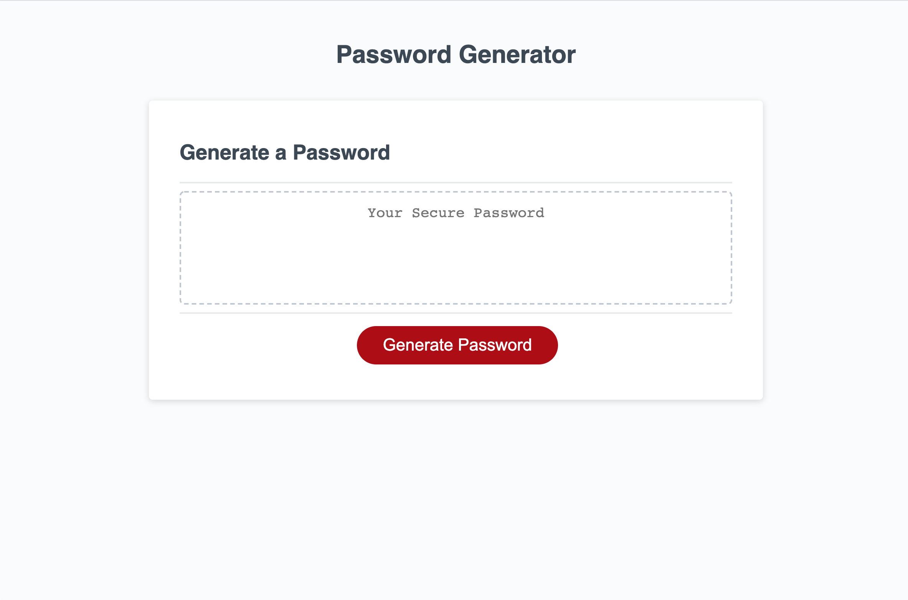

# bootcamp-homework3

This web based password generator accepts user input to define the desired length of a password, as well as what character types the user would like to enable (including uppercase and lowercase letters, numeric characters, and special characters). It uses these preferences to randomly generate a password following the given parameters. Passwords can be regenerated as requested. This lightweight application is perfect to enable users to use secure, difficult to guess passwords, without a network component.

The application can be found [here](https://caaam.github.io/bootcamp-homework3/).
